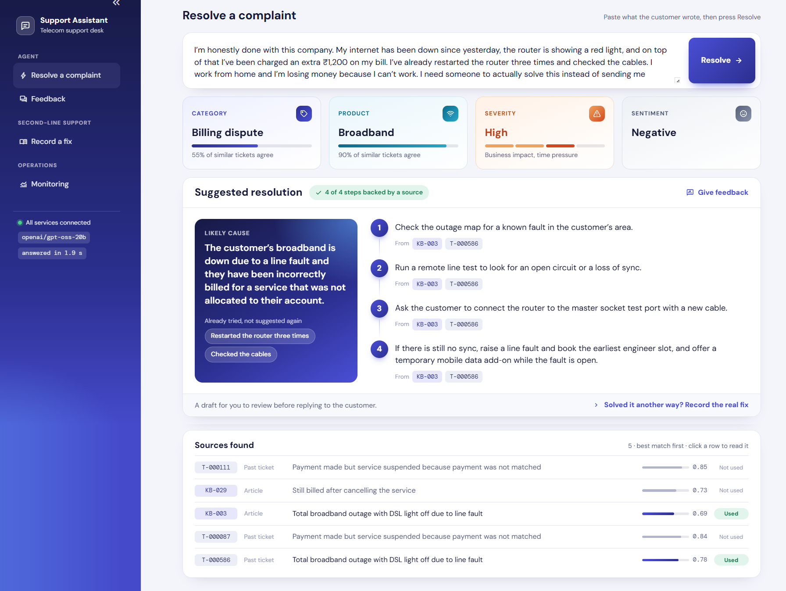
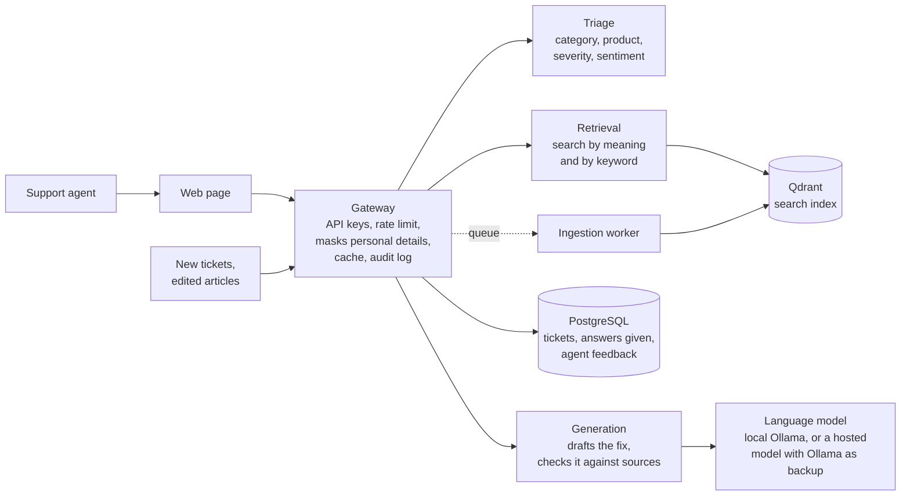
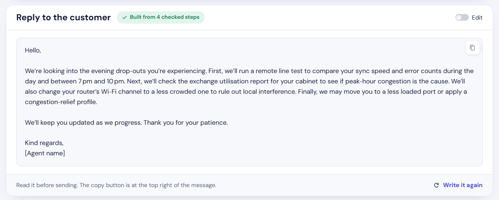
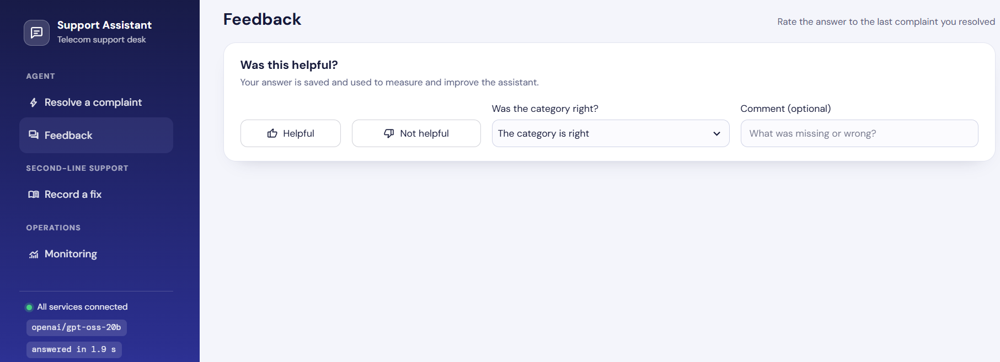
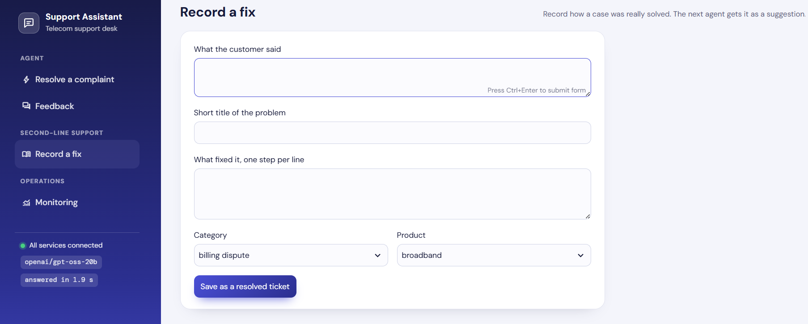
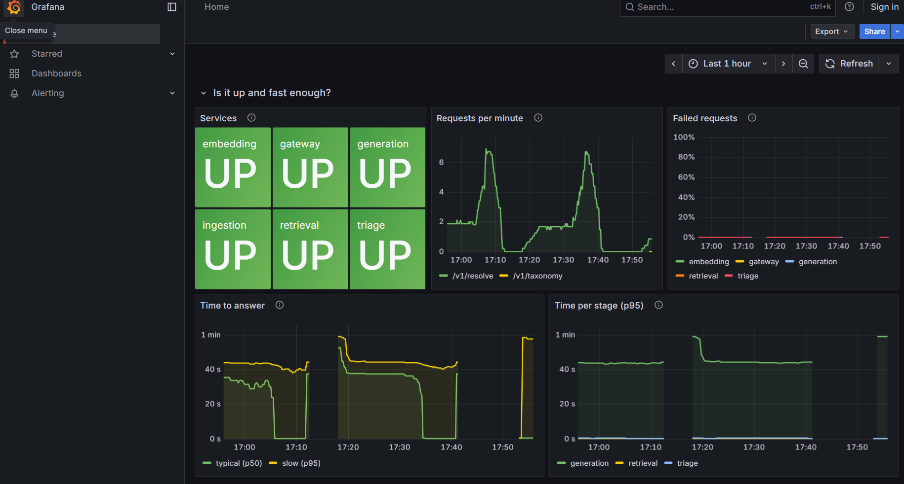

# Intelligent Support Ticket Resolution Assistant

A telecom support agent pastes a customer complaint and gets, in one screen:

1. **What it is**: category, product, severity and sentiment.
2. **What was done before**: similar past tickets and knowledge-base articles, found by meaning, not only by keywords.
3. **What to do now**: a drafted step-by-step fix in which every step names the ticket or article it came from.

One more click drafts **the reply to the customer**, written only from the steps that passed the source check.
And when several customers report the same fault within minutes, the page says so: **possible service incident**.

It is built as small services, runs on a laptop with one command, and needs no paid API and no API key.



## Contents

| Section | In one line |
|---|---|
| [How it works](#how-it-works) | The path of one complaint through the services |
| [Run it](#run-it) | Five commands, about ten minutes the first time |
| [Try it](#try-it) | Four complaints worth typing, and what to expect |
| [What was measured](#what-was-measured) | Every claim has a number and a script behind it |
| [When a complaint is new](#when-a-complaint-is-new) | How the system learns a fix it did not have |
| [What makes it production-grade](#what-makes-it-production-grade) | Failures, security, new data, monitoring |
| [Known limits](#known-limits) | What it does badly, stated plainly |
| [Where to read more](#where-to-read-more) | Architecture, design decisions, full command guide |

## How it works



| Step | What happens | Typical time |
|---|---|---|
| 1 | The gateway checks the caller and masks emails, phone and account numbers | instant |
| 2 | Triage labels the complaint by a vote among the most similar past tickets | under 1 s |
| 3 | Retrieval finds the 3 closest tickets and 2 closest articles | under 1 s |
| 4 | If nothing is similar enough, it stops here and recommends escalation | |
| 5 | The language model drafts a fix. Every step must cite a source, and each citation is checked | 31 s local, 1.4 s hosted |
| 6 | The request, the answer and the agent's feedback are recorded | |

## Run it

You need [Docker Desktop](https://www.docker.com/products/docker-desktop/) and [Ollama](https://ollama.com/download).

```bash
ollama pull llama3.2:3b                                  # the local language model (2 GB)
cp .env.example .env                                     # Windows PowerShell: copy .env.example .env
docker compose up -d --build                             # first build takes several minutes
docker compose ps                                        # every service should show "healthy"
docker compose run --rm tools python scripts/seed.py     # load the data (about a minute)
```

Then open **http://localhost:8501** and press **Resolve**.

| Open | Address |
|---|---|
| Agent web page | http://localhost:8501 |
| API with interactive docs | http://localhost:8000/docs |
| Monitoring dashboard (no login) | http://localhost:3000 |
| Alerts | http://localhost:9090/alerts |

- Without Ollama it still works: the steps are then quoted from the best matching source.
- A faster hosted model is optional and takes three lines in `.env`. See
  [Choosing the language model](docs/GUIDE.md#choosing-the-language-model).
- A port is already in use? Change it in `.env`, for example `REDIS_PORT=6380`.

## Try it

| Type this | What to expect |
|---|---|
| The complaint already in the box (broadband drops every evening) | Labels, five sources, and a fix in which each step cites its sources. "Restarted the router twice" is listed as already tried and is not suggested again. |
| Press **Draft reply to customer** under the fix | A message you can edit and copy. It apologises if the customer was upset, does not ask them to repeat what they already tried, and contains no ticket numbers. |
| `I was charged twice this month` | A billing category this time, and a fix drawn from the billing tickets and articles. |
| Run `docker compose run --rm tools python scripts/simulate_incident.py`, then resolve the complaint it prints | Six customers have just reported the same outage in their own words, so a **Possible service incident** notice appears above the labels, with the other complaints one click away. The `PossibleIncident` alert fires too. |
| `What is the best recipe for chocolate cake?` | Not a telecom problem, so it should be stopped: no fix is drafted and escalation is recommended. (77% of off-topic questions are stopped this way.) |
| Any problem the knowledge base does not cover | Escalation. Click **Record the real fix**, save a fix on the Record a fix page, go back and press Resolve again: the new fix is now used. |

The reply to the customer, drafted with one click from the steps that passed the source check:



The menu on the left has one page for each kind of user:

| Page | Who it is for | What it does |
|---|---|---|
| Resolve a complaint | Support agent | Labels, the drafted fix and the sources |
| Feedback | Support agent | Rate the last answer: helpful or not, was the category right, an optional comment |
| Record a fix | Expert | Record how a case was really solved, so the next agent gets it as a suggestion |
| Monitoring | Engineer | Opens the Grafana dashboard |

<p>
  
  
</p>

The same from the command line or as an API call:

```bash
docker compose run --rm tools python scripts/demo.py "I was charged twice this month"

curl -X POST http://localhost:8000/v1/resolve \
  -H "X-API-Key: dev-local-key" -H "Content-Type: application/json" \
  -d '{"complaint": "My broadband drops every evening around 8"}'
```

## What was measured

Every number comes from a script in `evals/` and can be reproduced. The test complaints
deliberately use wording that never appears in the indexed tickets, so this is the hard case.

| Question | Result |
|---|---|
| Does search by meaning beat keyword search? | The right ticket comes first for **55%** of complaints, against 40% for keywords. |
| How good are the labels? | Category 71%, product 78%, sentiment 83%, severity 59% exact and 93% within one level. |
| How fast does new data arrive? | A new ticket is searchable **a few seconds** after one API call. Nothing is retrained or restarted. |
| Can it learn a new kind of problem? | Search: yes, from a handful of tickets. Category: 18 of 20 for one new class, 1 of 20 for one that overlaps existing classes. |
| Is every step backed by its source? | **100%** of steps in answers to known problems. |
| Are off-topic questions stopped? | 77% by the similarity cut-off, before any model is asked. |
| Is an outage noticed? | Seven customers reporting one fault among twenty other complaints are flagged in **71%** of cases, and 2% of quiet half hours are flagged by mistake. The first guess for the settings managed 38% and 16%; the eval replaced it. |

### Two language models on the same 56 complaints

| | Local `llama3.2:3b` | Hosted `gpt-oss-20b` |
|---|---|---|
| Known problems answered correctly (of 20) | 11 | **15** |
| When the search had found the right source (15) | 11 right, 3 mixed, 1 wrong | **15 of 15 right** |
| When the search had missed it (5) | 5 wrong answers | 3 wrong, 2 refused |
| Problems with no fix in the knowledge base (6) | 6 wrong answers | 3 wrong, **3 refused** |
| Off-topic questions that reached the model (7) | 7 answered | **7 refused** |
| Typical time per drafted answer | 31 s | **1.4 s** |

What this shows: with the larger model, every remaining wrong answer on a known problem is a
search miss. The model is no longer the weak link; the search is. These are single runs on small
groups, so read the table as a direction, not as exact rates.

## When a complaint is new

No knowledge base covers everything. What matters is what the system does when it has no fix.

**new complaint → escalate → expert solves it → system learns it → the next customer gets the answer**

| Step | What happens here |
|---|---|
| 1. Notice | A similarity cut-off stops complaints that match nothing known |
| 2. Do not guess | Nothing is drafted. The closest sources are still shown |
| 3. Human review | Every draft shows its sources. On the Feedback page the agent can mark it "not helpful" or correct the category |
| 4. Learn | The Record a fix page, or one API call. Searchable in seconds |
| 5. Spot a trend | A script groups similar unknown complaints and proposes a new ticket class for a person to approve |
| 6. Raise an alarm | Alerts for falling similarity, rising escalations and "none of the categories fits" |

## What makes it production-grade

| Concern | What is built |
|---|---|
| A part fails | Each service can fail without taking the rest down. Model down: the backup model answers, then steps are quoted from the source (and the customer reply falls back to a template). Triage down: answer without labels. Cache or database down: still answer. |
| Security and privacy | API keys with separate agent and admin rights, a per-key rate limit, and personal details masked before anything is stored or sent to a model |
| Data that changes | New tickets, edited articles and new ticket classes go live through the API, by a queue with retries and a safety sweep. Old cached answers are dropped automatically |
| Trust in the answer | Citations are checked against the sources, unsupported steps are flagged, "already tried" items the customer never said are removed. The customer reply uses only steps that passed these checks |
| Seeing the bigger picture | Complaints that mean the same and arrive close together are flagged as a possible incident, on the page and by an alert. One customer is a ticket; twenty with the same fault is an outage |
| Knowing it is healthy | 18 alert rules with their own tests, a 25-panel dashboard, one-command health check, one log line per request with the same ID in every service |
| Knowing it is correct | Six eval scripts, 322 fast tests, 23 tests against the running system, and CI on every push |



## Known limits

- **Search is the weak link.** The right source is among those given to the model for about four
  complaints in five. Almost every wrong answer starts there.
- **It does not always know when it has no fix.** For a telecom problem the knowledge base does not
  cover, the local model drafts a confident wrong answer; the larger model refuses half of them.
  A person must review every draft.
- **The customer reply is not measured yet.** Rules check its form (no ticket numbers, length, sign-off) and it
  only receives checked steps, but its wording has no eval. The agent reads it before sending.
- **Incident detection only reads the complaint text.** It has no network or location data, and the same words
  count once. It is a hint for a person, not an outage system.
- **The data is synthetic**, built from 40 hand-written problem scenarios. Real tickets are messier.
- **Small samples** in the answer eval (20 known complaints). The numbers show direction, not precision.

## Where to read more

| Document | What is in it |
|---|---|
| [docs/ARCHITECTURE.md](docs/ARCHITECTURE.md) | The design in plain words, the diagrams, how each requirement is met, scale considerations |
| [docs/DESIGN_DECISIONS.md](docs/DESIGN_DECISIONS.md) | Each choice, the alternative, and the measurement behind it, including the ideas that were tried and rejected |
| [docs/GUIDE.md](docs/GUIDE.md) | Every address and command: the API, adding data and classes, the model settings, running each eval, monitoring, tests |

| Folder | What is in it |
|---|---|
| `services/` | Gateway, triage, retrieval, generation, embedding, ingestion worker |
| `ui/` | The agent web page |
| `evals/` | The measurement scripts and their saved results |
| `tests/` | Fast tests and tests against the running system |
| `infra/` | Database schema, alert rules, dashboard, CI workflow |
| `data/` | The 40 scenarios and the generated tickets, articles and test complaints |
