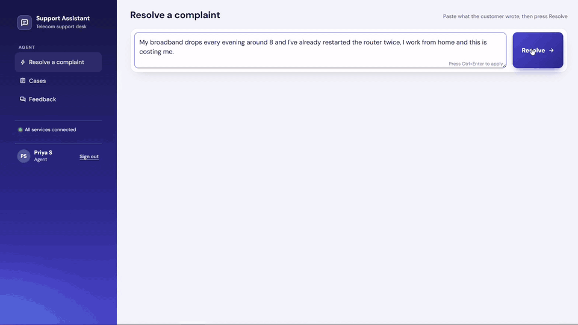
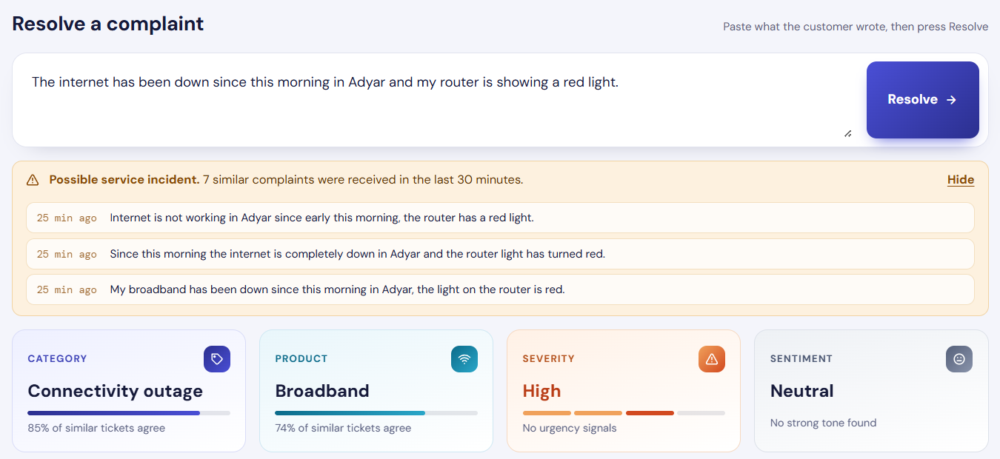
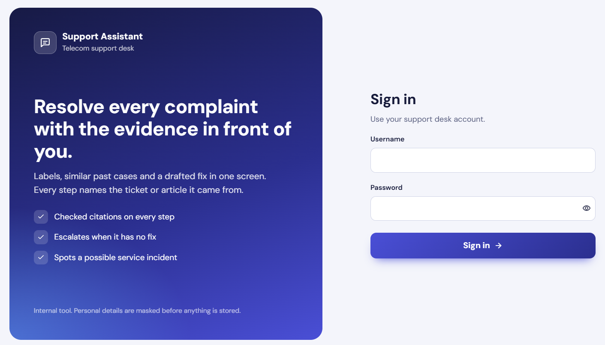
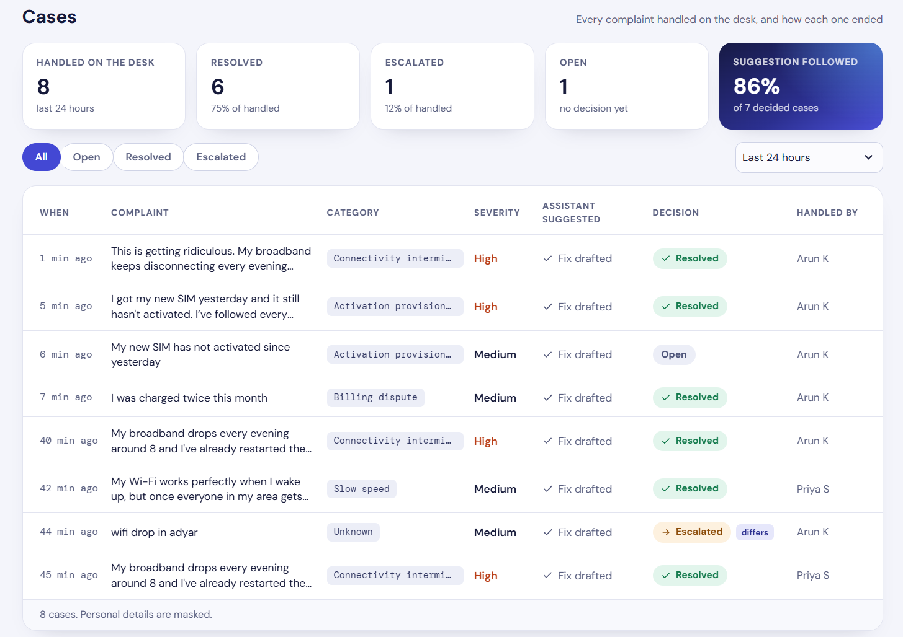
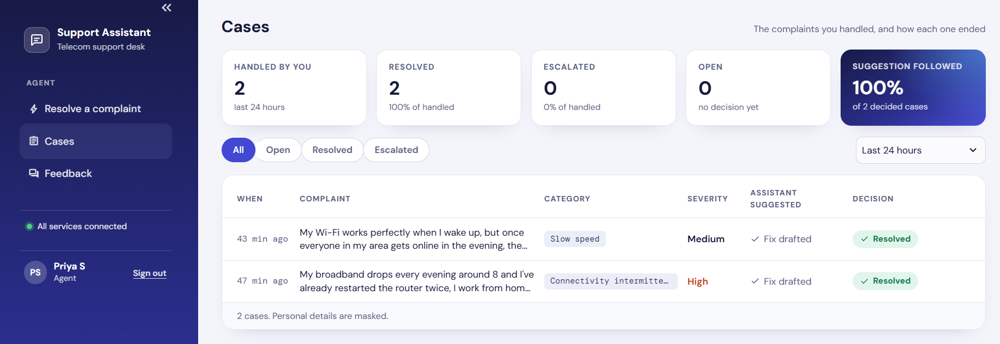
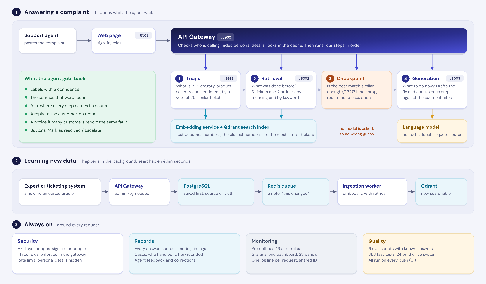
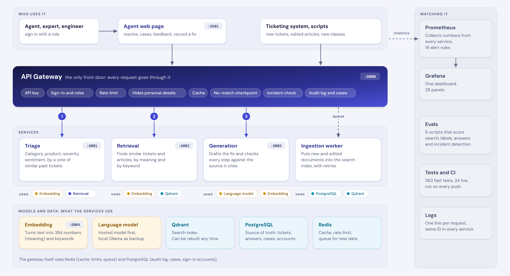
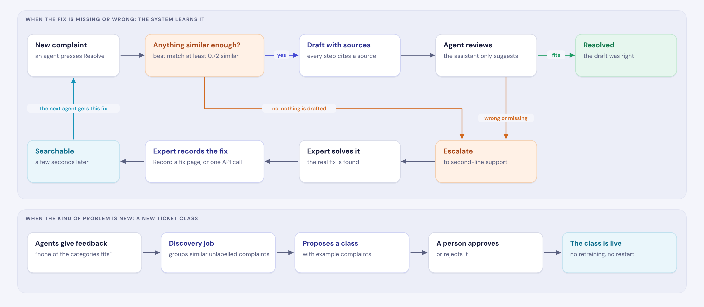

# Intelligent Support Ticket Resolution Assistant

[](https://github.com/unnathivinod/ticket-resolution-assistant-/actions/workflows/ci.yml)


A telecom support agent pastes a customer complaint and gets labels, the most similar past cases, and a drafted
step-by-step fix in which **every step names the ticket or article it came from**. When nothing similar is found,
it does not guess: it recommends escalation.

1. **What it is**: category, product, severity and sentiment.
2. **What was done before**: similar past tickets and knowledge-base articles, found by meaning, not only by keywords.
3. **What to do now**: a drafted fix, checked against its sources.

It is built as small services, runs on a laptop with one command, and needs no paid API and no API key.

## At a glance

Every number comes from a script in [`evals/`](evals) and can be reproduced. [The full results](#what-was-measured)
include the ones that are not flattering.

<table>
  <tr>
    <td align="center" width="33%"><h3>55% vs 40%</h3>the right past ticket ranked first:<br>search by meaning against keyword search</td>
    <td align="center" width="33%"><h3>100%</h3>of steps backed by the source they cite,<br>in answers to known problems</td>
    <td align="center" width="33%"><h3>77%</h3>of off-topic questions stopped<br>before any language model is asked</td>
  </tr>
  <tr>
    <td align="center"><h3>15 of 20</h3>known problems answered correctly<br>by the hosted model on Groq, in about 1.4 s each</td>
    <td align="center"><h3>71%</h3>of simulated outages noticed,<br>with 2% false alarms</td>
    <td align="center"><h3>A few seconds</h3>until a new ticket or a recorded fix<br>is searchable. Nothing is retrained</td>
  </tr>
</table>

## Demo

Four highlights: a resolved complaint, the reply to the customer, an agent's cases and an expert's view of the whole desk.



## What the brief asked for, and where it is

| Asked for | Where |
|---|---|
| Architecture diagram | [Architecture](#architecture) below; three more diagrams in [docs/ARCHITECTURE.md](docs/ARCHITECTURE.md) |
| Full executable code | This repository. [Run it](#run-it) with five commands |
| Classify the complaint, retrieve similar cases, draft a cited fix | [How it works](#how-it-works) |
| Evolving data and ticket classes | [When a complaint is new](#when-a-complaint-is-new) |
| Additional exploration | [Features](#features): reply to the customer, incident detection, sign-in with roles and cases, new-class discovery |
| Evals on system health | [What was measured](#what-was-measured); alerts and dashboard under [production-grade](#what-makes-it-production-grade) |
| Production scale considerations | [What makes it production-grade](#what-makes-it-production-grade); [scale table](docs/ARCHITECTURE.md#9-production-scale-considerations) |

**Contents:** [Features](#features) · [How it works](#how-it-works) · [Architecture](#architecture) ·
[What was measured](#what-was-measured) · [When a complaint is new](#when-a-complaint-is-new) ·
[Production-grade](#what-makes-it-production-grade) · [Tech stack](#tech-stack) · [Run it](#run-it) ·
[Try it](#try-it) · [Known limits](#known-limits) · [Where to read more](#where-to-read-more)

## Features

The Resolve page: one complaint in; labels, a cited fix and the sources out. "Restarted the router twice" is
recognised as already tried and is not suggested again.

<p align="center">
  
</p>

<table>
  <tr>
    <td width="50%" valign="top">
      <br>
      <b>Reply to the customer</b><br>
      One click drafts a message, written only from the steps that passed the source check. No ticket numbers, and nothing the customer already tried.
    </td>
    <td width="50%" valign="top">
      <br>
      <b>Possible service incident</b><br>
      Several customers reporting the same fault within minutes raise a notice, with the other complaints one click away.
    </td>
  </tr>
  <tr>
    <td width="50%" valign="top">
      <br>
      <b>Sign-in with roles</b><br>
      Agent, second-line expert or engineer. The role decides the menu and what a person may see, and the gateway enforces it.
    </td>
    <td width="50%" valign="top">
      <br>
      <b>Cases: an expert sees the whole desk</b><br>
      With who handled each case. A case marked <b>differs</b> ended differently from the suggestion.
    </td>
  </tr>
  <tr>
    <td width="50%" valign="top">
      <br>
      <b>Cases: an agent sees only their own</b><br>
      What was handled, what the assistant suggested, and what the agent decided.
    </td>
    <td width="50%" valign="top">
      <br>
      <b>Monitoring</b><br>
      One dashboard for health, answer quality, drift, the language model and new data, with 19 tested alerts behind it.
    </td>
  </tr>
  <tr>
    <td width="50%" valign="top">
      <br>
      <b>Feedback</b><br>
      Helpful or not, was the category right, an optional comment. It feeds the quality alerts.
    </td>
    <td width="50%" valign="top">
      <br>
      <b>Record a fix</b><br>
      How a case was really solved, recorded by an expert. The next agent gets it as a suggestion within seconds.
    </td>
  </tr>
</table>

The menu on the left depends on who signed in:

| Page | Who gets it | What it does |
|---|---|---|
| Resolve a complaint | Everyone | Labels, the drafted fix and the sources. Under the fix: **Mark as resolved** or **Escalate to second line** |
| Cases | Everyone | What was handled and how it ended. An agent sees their own cases, an expert or engineer sees all of them |
| Feedback | Everyone | Rate the last answer: helpful or not, was the category right, an optional comment |
| Record a fix | Expert, engineer | Record how a case was really solved, so the next agent gets it as a suggestion |
| Monitoring | Engineer | Opens the Grafana dashboard |

## How it works



| Step | What happens | Typical time |
|---|---|---|
| 1 | The gateway checks the caller and masks emails, phone and account numbers | instant |
| 2 | Triage labels the complaint by a vote among the most similar past tickets | under 1 s |
| 3 | Retrieval finds the 3 closest tickets and 2 closest articles | under 1 s |
| 4 | If nothing is similar enough, it stops here and recommends escalation | |
| 5 | The language model drafts a fix. Every step must cite a source, and each citation is checked | 31 s local (Ollama), 1.4 s hosted (Groq) |
| 6 | The request, the answer and the agent's feedback are recorded | |

## Architecture

Seven small services behind one gateway. Every request enters through the gateway, which calls the services in
the order of the numbers. The dashed line is the queue: new data is indexed in the background.



| Service | Port | Its one job |
|---|---|---|
| Gateway | 8000 | The only front door: API keys, sign-in and roles, rate limit, masking of personal details, cache, checkpoints, audit log, cases |
| Triage | 8001 | Category, product, severity and sentiment. Says "unknown" when unsure |
| Retrieval | 8002 | Finds the most similar tickets and articles; counts similar recent complaints |
| Generation | 8003 | Builds the prompt, calls the model, checks the answer. Backup model, then quotes the source |
| Embedding | 8004 | Turns text into numbers that capture meaning, and into keywords |
| Ingestion worker | | Keeps the search index in step with the database, with retries and a safety sweep |
| Web page | 8501 | Sign in, resolve, draft the reply, record the decision, list the cases, give feedback |

One request step by step, and the reasoning behind each part, are in [docs/ARCHITECTURE.md](docs/ARCHITECTURE.md).

## What was measured

Every number comes from a script in `evals/` and can be reproduced. The test complaints
deliberately use wording that never appears in the indexed tickets, so this is the hard case.

| Question | Result |
|---|---|
| Does search by meaning beat keyword search? | The right ticket comes first for **55%** of complaints, against 40% for keywords. |
| How good are the labels? | Category 71%, product 78%, sentiment 83%, severity 59% exact and 93% within one level. |
| How fast does new data arrive? | A new ticket is searchable **a few seconds** after one API call. Nothing is retrained or restarted. |
| Can it learn a new kind of problem? | Search: yes, from a handful of tickets. Category: 18 of 20 for one new class, 1 of 20 for one that overlaps existing classes. |
| Is every step backed by its source? | **100%** of steps in answers to known problems. |
| Are off-topic questions stopped? | 77% by the similarity cut-off, before any model is asked. |
| Is an outage noticed? | Seven customers reporting one fault among twenty other complaints are flagged in **71%** of cases, and 2% of quiet half hours are flagged by mistake. The first guess for the settings managed 38% and 16%; the eval replaced it. |

### Two language models on the same 56 complaints

| | Local `llama3.2:3b` on Ollama | Hosted `gpt-oss-20b` on Groq |
|---|---|---|
| Known problems answered correctly (of 20) | 11 | **15** |
| When the search had found the right source (15) | 11 right, 3 mixed, 1 wrong | **15 of 15 right** |
| When the search had missed it (5) | 5 wrong answers | 3 wrong, 2 refused |
| Problems with no fix in the knowledge base (6) | 6 wrong answers | 3 wrong, **3 refused** |
| Off-topic questions that reached the model (7) | 7 answered | **7 refused** |
| Typical time per drafted answer | 31 s | **1.4 s** |

What this shows: with the larger model, every remaining wrong answer on a known problem is a
search miss. The model is no longer the weak link; the search is. These are single runs on small
groups, so read the table as a direction, not as exact rates.

## When a complaint is new

No knowledge base covers everything. What matters is what the system does when it has no fix.

**new complaint → escalate → expert solves it → system learns it → the next customer gets the answer**

| Step | What happens here |
|---|---|
| 1. Notice | A similarity cut-off stops complaints that match nothing known |
| 2. Do not guess | Nothing is drafted. The closest sources are still shown |
| 3. Human review | Every draft shows its sources. On the Feedback page the agent can mark it "not helpful" or correct the category |
| 4. Learn | The Record a fix page, or one API call. Searchable in seconds |
| 5. Spot a trend | A script groups similar unknown complaints and proposes a new ticket class for a person to approve |
| 6. Raise an alarm | Alerts for falling similarity, rising escalations and "none of the categories fits" |



## What makes it production-grade

| Concern | What is built |
|---|---|
| A part fails | Each service can fail without taking the rest down. Model down: the backup model answers, then steps are quoted from the source (and the customer reply falls back to a template). Triage down: answer without labels. Cache or database down: still answer. |
| Security and privacy | API keys with separate agent and admin rights, a per-key rate limit, and personal details masked before anything is stored or sent to a model |
| Who did what | People sign in (salted, slow password hashes; a signed session token that ends after a working day). The role decides what a person sees, and the gateway enforces it, not the page. Every case is stored with who handled it and how it ended |
| Data that changes | New tickets, edited articles and new ticket classes go live through the API, by a queue with retries and a safety sweep. Old cached answers are dropped automatically |
| Trust in the answer | Citations are checked against the sources, unsupported steps are flagged, "already tried" items the customer never said are removed. The customer reply uses only steps that passed these checks |
| Seeing the bigger picture | Complaints that mean the same and arrive close together are flagged as a possible incident, on the page and by an alert. One customer is a ticket; twenty with the same fault is an outage |
| Knowing it is healthy | 19 alert rules with their own tests, a 28-panel dashboard, one-command health check, one log line per request with the same ID in every service |
| Knowing it is correct | Six eval scripts, 363 fast tests, 24 tests against the running system, and CI on every push. In live use: how often agents do what the assistant suggested |

## Tech stack

| Part | Built with | Why |
|---|---|---|
| Services | Python 3.11, FastAPI | Small typed services, with interactive API docs for free |
| Search index | Qdrant | Search by meaning and by keyword in one query |
| Embeddings | `bge-small-en-v1.5` and BM25, run locally with FastEmbed | No key, no cost; one service owns the models |
| Language model | Ollama `llama3.2:3b` locally (about 31 s per answer on a laptop CPU), or a hosted model such as `gpt-oss-20b` on Groq (about 1.4 s) | Runs for a reviewer with no key. Any OpenAI-compatible provider works; a hosted model can be put first, with Ollama as its backup |
| Source of truth | PostgreSQL | Tickets, answers given, cases, accounts. The search index can always be rebuilt from it |
| Cache, limits, queue | Redis | Answer cache, rate-limit counters, and a stream that carries new data to the indexer |
| Web page | Streamlit | A thin page on top of the gateway API, with no logic of its own |
| Monitoring | Prometheus, Grafana | Alert rules with their own tests; a dashboard built from code |
| Running it | Docker Compose | Twelve containers, one command |
| Quality | pytest, ruff, GitHub Actions | Tests and style checks on every push |

The reasons behind the larger choices, with the alternatives that were tried and rejected, are in
[docs/DESIGN_DECISIONS.md](docs/DESIGN_DECISIONS.md).

## Run it

You need [Docker Desktop](https://www.docker.com/products/docker-desktop/) and [Ollama](https://ollama.com/download).

```bash
ollama pull llama3.2:3b                                  # the local language model (2 GB)
cp .env.example .env                                     # Windows PowerShell: copy .env.example .env
docker compose up -d --build                             # first build takes several minutes
docker compose ps                                        # every service should show "healthy"
docker compose run --rm tools python scripts/seed.py     # load the data (about a minute)
```

Then open **http://localhost:8501**, sign in as `priya` with the password `demo1234`, and press **Resolve**.

Three demo accounts exist straight after setup. They share one password: `demo1234`.

| Username | Role | Sees |
|---|---|---|
| `priya` | Agent | Resolve, Feedback, and only their own cases |
| `arun` | Second-line expert | The same, plus Record a fix and every agent's cases |
| `meera` | Engineer | Everything, plus the Monitoring link |

| Open | Address |
|---|---|
| Agent web page | http://localhost:8501 |
| API with interactive docs | http://localhost:8000/docs |
| Monitoring dashboard (no login) | http://localhost:3000 |
| Alerts | http://localhost:9090/alerts |

- Without Ollama it still works: the steps are then quoted from the best matching source.
- A faster hosted model is optional and takes three lines in `.env`. The measurements here used `gpt-oss-20b` on Groq's free plan. See
  [Choosing the language model](docs/GUIDE.md#choosing-the-language-model).
- A port is already in use? Change it in `.env`, for example `REDIS_PORT=6380`.
- Updating a copy that was already running? `docker compose run --rm tools python scripts/migrate.py` adds the
  new tables (sign-in accounts, case decisions) to the existing database. A fresh copy does not need it.

## Try it

| Type this | What to expect |
|---|---|
| The complaint already in the box (broadband drops every evening) | Labels, five sources, and a fix in which each step cites its sources. "Restarted the router twice" is listed as already tried and is not suggested again. |
| Press **Draft reply to customer** under the fix | A message you can edit and copy. It apologises if the customer was upset, does not ask them to repeat what they already tried, and contains no ticket numbers. |
| Press **Mark as resolved** or **Escalate to second line** under the fix, then open **Cases** | The case is listed with what the assistant suggested and what you decided. A case where the two differ is marked. The top row counts how often the suggestion was followed. |
| Sign out, sign in as `arun` (same password), open **Cases** | An expert sees every agent's cases, with a **Handled by** column. Signed in as `priya` you only ever see your own, and the gateway refuses the others even when asked directly. |
| `I was charged twice this month` | A billing category this time, and a fix drawn from the billing tickets and articles. |
| Run `docker compose run --rm tools python scripts/simulate_incident.py`, then resolve the complaint it prints | Six customers have just reported the same outage in their own words, so a **Possible service incident** notice appears above the labels, with the other complaints one click away. The `PossibleIncident` alert fires too. |
| `What is the best recipe for chocolate cake?` | Not a telecom problem, so it should be stopped: no fix is drafted and escalation is recommended. (77% of off-topic questions are stopped this way.) |
| Any problem the knowledge base does not cover (signed in as `arun`) | Escalation. Click **Record the real fix**, save a fix on the Record a fix page, go back and press Resolve again: the new fix is now used. |

The same from the command line or as an API call:

```bash
docker compose run --rm tools python scripts/demo.py "I was charged twice this month"

curl -X POST http://localhost:8000/v1/resolve \
  -H "X-API-Key: dev-local-key" -H "Content-Type: application/json" \
  -d '{"complaint": "My broadband drops every evening around 8"}'
```

## Known limits

- **Search is the weak link.** The right source is among those given to the model for about four
  complaints in five. Almost every wrong answer starts there.
- **It does not always know when it has no fix.** For a telecom problem the knowledge base does not
  cover, the local model drafts a confident wrong answer; the larger model refuses half of them.
  A person must review every draft.
- **The customer reply is not measured yet.** Rules check its form (no ticket numbers, length, sign-off) and it
  only receives checked steps, but its wording has no eval. The agent reads it before sending.
- **Incident detection only reads the complaint text.** It has no network or location data, and the same words
  count once. It is a hint for a person, not an outage system.
- **Sign-in is basic.** Three demo accounts with one public password, no single sign-on, no password reset, and
  an account that is switched off keeps working until its session ends (up to eight hours). A case is one
  press of Resolve, not a full ticket with a history.
- **The data is synthetic**, built from 40 hand-written problem scenarios. Real tickets are messier.
- **Small samples** in the answer eval (20 known complaints). The numbers show direction, not precision.

## Where to read more

| Document | What is in it |
|---|---|
| [docs/Project-Overview.pdf](docs/Project-Overview.pdf) | Ten pages with screenshots: what it does, the architecture, what was measured, the design decisions, how to run it |
| [docs/ARCHITECTURE.md](docs/ARCHITECTURE.md) | The design in plain words, the diagrams, how each requirement is met, scale considerations |
| [docs/DESIGN_DECISIONS.md](docs/DESIGN_DECISIONS.md) | Each choice, the alternative, and the measurement behind it, including the ideas that were tried and rejected |
| [docs/GUIDE.md](docs/GUIDE.md) | Every address and command: the API, adding data and classes, the model settings, running each eval, monitoring, tests |

| Folder | What is in it |
|---|---|
| `services/` | Gateway, triage, retrieval, generation, embedding, ingestion worker |
| `ui/` | The agent web page |
| `evals/` | The measurement scripts and their saved results |
| `tests/` | Fast tests and tests against the running system |
| `infra/` | Database schema, alert rules, dashboard, CI workflow |
| `data/` | The 40 scenarios and the generated tickets, articles and test complaints |
