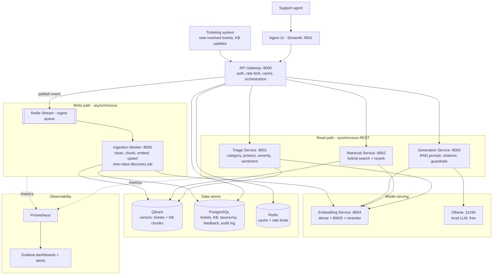
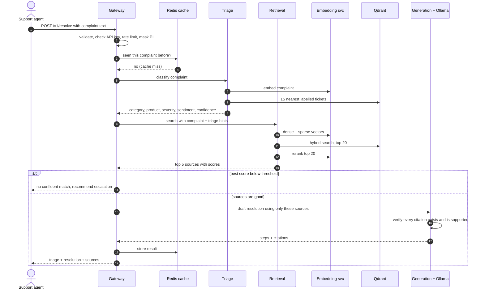

# Intelligent Support Ticket Resolution Assistant — Architecture & Build Plan

**Use Case 2 · Telecom support desk · Semantic search + RAG · Microservices**

> **In one sentence:** a support agent pastes a raw customer complaint and gets back (1) what the complaint is about, (2) the most similar past tickets and help articles, and (3) a step-by-step fix written by an AI that cites exactly which past tickets/articles it used.

---

## 1. The problem, in plain words

| | Today (keyword search) | What we build (semantic search + RAG) |
|---|---|---|
| How agents search | Type "router" or "billing" | Paste the whole complaint as-is |
| What goes wrong | "My wifi keeps dying at night" does not match a ticket titled "Intermittent broadband drop – evening congestion" because the words differ | Matches by **meaning**, not words |
| What the agent gets | A list of tickets to read one by one | A drafted resolution with sources, ready to review |
| Business impact | Slow handling time, inconsistent answers | Faster resolution, consistent answers, new agents perform like experienced ones |

**Three things the system must do (from the brief):**

1. **Parse** the complaint → intent/category, product, severity, customer sentiment.
2. **Retrieve + generate** → find similar resolved tickets and knowledge-base (KB) articles, then draft a grounded, cited, step-by-step resolution.
3. **Handle evolving data and ticket classes** → new tickets, updated articles and brand-new problem types must work without rebuilding the system.

**Details in the example complaint worth noticing** (shows problem understanding):

- *"drops every evening around 8"* → a time pattern, pointing to congestion rather than a broken router.
- *"already restarted the router twice"* → the answer must **not** repeat steps the customer already tried.
- *"I work from home and this is costing me"* → business impact raises severity; sentiment is frustrated.
- The user is a **support agent**, not the customer. The AI writes a **draft**; a human reviews it before anything reaches the customer.

---

## 2. Words you need to know (beginner glossary)

| Term | Simple meaning |
|---|---|
| **Embedding** | Turning a sentence into a list of numbers (e.g. 384 numbers) so that sentences with similar meaning have similar numbers. |
| **Vector database** | A database that stores those number-lists and quickly finds the closest ones. We use Qdrant. |
| **Semantic search** | Search by meaning: embed the question, find the nearest stored embeddings. |
| **BM25 / keyword search** | Classic word-matching search. Still useful for exact things like error codes ("E-102") or plan names. |
| **Hybrid search** | Run semantic + keyword search together and merge the results. Better than either alone. |
| **Reranker** | A second, more careful model that re-orders the top ~20 results so the best 5 come first. |
| **LLM** | Large Language Model, the text-writing AI. We run a small free one locally with Ollama. |
| **RAG** | Retrieval-Augmented Generation: first *retrieve* real documents, then ask the LLM to write an answer *using only those documents*. Stops it from making things up. |
| **Grounded / citation** | Every step in the answer points to the ticket or article it came from, e.g. `[KB-014]`. |
| **Microservice** | A small program with one job, talking to other small programs over HTTP. |
| **Docker / Docker Compose** | Packages each service in a box (container) and starts all of them with one command. |

---

## 3. Architecture diagram

### 3.1 System overview



### 3.2 Same picture as plain text (works in any viewer)

```
                     Support agent
                          |
                   [ Streamlit UI ]
                          |
   new tickets /    [ API GATEWAY ]  --- Redis (cache, rate limit)
   KB updates  -->   auth, limits,   --- Postgres (audit log, feedback)
                     orchestration
          ________________|___________________________
         |                |                |          |
   [ TRIAGE ]       [ RETRIEVAL ]    [ GENERATION ]   +--> Redis Stream (queue)
   classify         hybrid search    RAG + citation              |
         |           + rerank         check                [ INGESTION WORKER ]
         |                |                |                clean, chunk, embed,
         +-------+--------+           [ OLLAMA ]            new-class discovery
                 |                    local LLM                   |
       [ EMBEDDING SERVICE ] <------------------------------------+
        dense + BM25 + rerank
                 |
            [ QDRANT ] vectors          [ POSTGRES ] source of truth

   All services expose /health, /ready, /metrics --> Prometheus --> Grafana
```

### 3.3 What happens on one request



---

## 4. The services (what each one does)

Six small services of our own, plus ready-made infrastructure. Each service is a FastAPI app of roughly 100–250 lines.

| # | Service | Port | Its one job | Talks to |
|---|---|---|---|---|
| 1 | **API Gateway** | 8000 | Single front door. Checks API key, rate limits, masks personal data, checks cache, calls the other services in order, saves an audit log, accepts feedback. | Triage, Retrieval, Generation, Redis, Postgres |
| 2 | **Triage** | 8001 | Reads the complaint and returns category, product, severity, sentiment, each with a confidence score. | Embedding, Qdrant |
| 3 | **Retrieval** | 8002 | Finds the most similar resolved tickets and KB chunks (hybrid search, then rerank). | Embedding, Qdrant |
| 4 | **Generation** | 8003 | Builds the prompt, calls the LLM, returns numbered steps with citations, verifies the citations. | Ollama, Embedding |
| 5 | **Embedding** | 8004 | The only place small ML models live: text → dense vector, text → BM25 sparse vector, rerank a list. | — |
| 6 | **Ingestion Worker** | 8005 | Background worker. Takes new/updated tickets and KB articles from the queue, cleans, chunks, embeds, saves. Also runs the "discover new ticket classes" job. | Redis Stream, Embedding, Qdrant, Postgres |
| – | **Agent UI** | 8501 | Simple Streamlit page: paste complaint, see triage badges, resolution, clickable sources, thumbs up/down. | Gateway |

**Infrastructure (ready-made Docker images, no code to write):**

| Component | Why it is there |
|---|---|
| **Qdrant** | Vector database. Stores embeddings and does hybrid search. |
| **PostgreSQL** | Source of truth: tickets, KB articles, taxonomy (list of classes), feedback, request audit log. |
| **Redis** | Cache for repeated complaints, rate-limit counters, and the ingestion queue (Redis Streams). |
| **Ollama** | Runs a free LLM locally (`llama3.2:3b` by default). No API key, no cost, works offline. |
| **Prometheus + Grafana** | Collect and display health metrics; fire alerts. |

### Main API contract

`POST /v1/resolve`

```json
{ "complaint": "My broadband drops every evening around 8 and I've already restarted the router twice, I work from home and this is costing me" }
```

Response (shortened):

```json
{
  "request_id": "9f1c...",
  "triage": {
    "category":  {"label": "connectivity_intermittent", "confidence": 0.86},
    "product":   {"label": "broadband", "confidence": 0.93},
    "severity":  {"label": "high", "reasons": ["business impact", "repeat issue"]},
    "sentiment": {"label": "negative", "score": -0.62}
  },
  "resolution": {
    "summary": "Likely evening network congestion, not a router fault.",
    "already_tried": ["restarted router"],
    "steps": [
      {"n": 1, "text": "Run a line test between 7 and 9 pm to confirm peak-hour drops.", "citations": ["KB-014"]},
      {"n": 2, "text": "Move the router to a less crowded Wi-Fi channel.", "citations": ["T-1042", "KB-014"]}
    ],
    "escalate": false,
    "grounded": true
  },
  "sources": [
    {"id": "KB-014", "type": "kb", "title": "Evening broadband drops", "score": 0.91},
    {"id": "T-1042", "type": "ticket", "title": "Wifi dies every night", "score": 0.88}
  ],
  "meta": {"model": "llama3.2:3b", "prompt_version": "v3", "index_version": "2026-10-03", "latency_ms": {"triage": 45, "retrieval": 210, "generation": 9400}}
}
```

Other endpoints: `POST /v1/tickets` and `POST /v1/kb` (add/update data), `POST /v1/feedback`, `GET /v1/admin/class-proposals`, and `/health`, `/ready`, `/metrics` on every service.

---

## 5. How each requirement is solved

### 5.1 Requirement 1 — Parse the complaint (Triage)

| Field | How | Why this way |
|---|---|---|
| **Category / intent** | k-nearest-neighbours (kNN): embed the complaint, fetch the 15 most similar *already-labelled* tickets, take a weighted vote. | No training step. A new class works as soon as a few labelled examples exist. Takes milliseconds. |
| **Product** | Same kNN vote (broadband, mobile, fibre, TV, landline, billing account). | Same benefits. |
| **Severity** | kNN vote **plus** simple business rules that raise it: outage words, repeat contact, business impact, vulnerable customer. Returns the reasons. | Severity depends on business policy, so rules must be visible and editable. |
| **Sentiment** | Small pretrained sentiment model (start with VADER; upgrade to a small transformer if evals show it is weak). | Sentiment classes never change, so a ready-made model is enough. |
| **Low confidence** | If the vote share is below a threshold (e.g. 0.5), label = `unknown` and flag the ticket for review. | Honest "I don't know" is better than a confident wrong label, and it feeds new-class discovery (5.3). |

*Optional upgrade:* when kNN confidence is low, ask the LLM for a structured JSON classification (cheap method first, expensive method only when needed).

### 5.2 Requirement 2 — Retrieve and generate (RAG)

**Retrieval pipeline**

| Step | What happens | Simple reason |
|---|---|---|
| 1. Embed query | Dense vector (`BAAI/bge-small-en-v1.5`, 384 numbers) + sparse BM25 vector. | Meaning + exact words. |
| 2. Hybrid search | Qdrant runs both searches and merges them with Reciprocal Rank Fusion (RRF). Top 20. | Semantic catches paraphrases, keyword catches codes and plan names. |
| 3. Soft boost | Results with the same product as triage get a small boost (hard filter only if triage confidence is high). | Uses triage without letting a wrong label hide good results. |
| 4. Rerank | Cross-encoder reranker re-scores the 20 and keeps the best 5. | A slower but smarter model on a small list. |
| 5. Threshold | If the best score is too low → return "no confident match, escalate". | Prevents confident nonsense. |

**What gets embedded (an important design choice):**

- **Past tickets:** embed the *problem description* (subject + customer text), and keep the *resolution steps* as attached data. A new complaint should match old complaints, not old answers.
- **KB articles:** split into chunks of about 300 tokens by heading with a small overlap, so each chunk is one focused topic.

**Generation pipeline**

1. Build a prompt containing the complaint, triage result, and the 5 sources, each tagged with its ID (`[T-1042]`, `[KB-014]`).
2. Rules in the prompt: use only the sources; cite an ID after every step; do not repeat steps the customer already tried; if the sources do not cover the issue, say so.
3. Ask the LLM for **structured JSON** (Ollama supports a JSON schema), so the output is always parseable.
4. **Verify after generation** (guardrails):
   - Every cited ID must be one of the 5 retrieved sources. Unknown IDs are removed.
   - Each step is compared (embedding similarity) with the source it cites. Unsupported steps are flagged.
   - Any step without a citation is dropped or marked "unverified".
5. **Fallback:** if the LLM is down or times out, return an "extractive" answer, meaning the resolution steps copied straight from the top matching ticket/article. The service still works without any LLM.

### 5.3 Requirement 3 — Evolving data and ticket classes

**Evolving data (new tickets, changed articles)**

| Situation | How it is handled |
|---|---|
| A ticket gets resolved | Gateway receives `POST /v1/tickets` → puts an event on the Redis Stream → ingestion worker cleans, embeds, and upserts it. Searchable within seconds, no retraining, no restart. |
| A KB article is edited | Upsert by article ID with a version number; old chunks are deleted, new ones added. |
| A resolution becomes outdated | `is_active = false` flag hides it from search; a recency boost prefers newer fixes. |
| The same event arrives twice | IDs are deterministic (hash of ticket ID), so upserts are idempotent: no duplicates. |
| A message fails | Retried 3 times, then moved to a dead-letter stream for inspection. |
| The embedding model is upgraded | Build a new Qdrant collection in the background, then switch an alias (blue-green re-index). Zero downtime, easy rollback. |

**Evolving classes (brand-new problem types)**

1. Classes are **rows in a `taxonomy` table**, not hard-coded in the program.
2. The kNN classifier learns a new class the moment a few labelled examples are indexed. No model retraining.
3. Low-confidence tickets go into an **`unknown` bucket**.
4. A scheduled **discovery job** clusters the unknown tickets (HDBSCAN on their embeddings). A cluster of, say, 20+ similar unknowns means a new problem type is emerging (e.g. "5G SIM swap failures").
5. The LLM suggests a name for the cluster; a human approves it in the admin endpoint; the class is added to the taxonomy and those tickets get labelled.
6. **Drift monitoring** watches the `unknown` rate, class distribution shift, and average top-match score. A rising unknown rate is the alarm that the world has changed.
7. **Feedback loop:** agent thumbs up/down is stored; good answers become future eval examples, bad ones get reviewed.

---

## 6. Data

### 6.1 Dataset choice

| Option | Verdict |
|---|---|
| Hugging Face *customer-support-tickets* | General IT/product support, not telecom; no sentiment labels; non-commercial licence. Good for a generalisation test only. |
| *Telecom Conversation Corpus* | Telecom, but raw chat turns with no labels and no clean resolution field. Good as realistic unlabelled test queries. |
| **Synthetic telecom tickets (chosen)** | The brief allows it. Gives exact telecom domain, all four labels, and **known correct answers for evals**. |

### 6.2 How the synthetic data is built

1. Write about **40 "issue scenarios"** by hand (e.g. evening congestion, double billing, SIM not activating, roaming not working, set-top box error E-102, number porting delay). Each has: category, product, root cause, resolution steps.
2. Write **one KB article per scenario** (about 40–50 articles).
3. Generate **about 50 differently-worded complaints per scenario** using templates plus the local LLM for paraphrasing, varying tone, severity and detail → roughly **2,000 tickets**.
4. Each ticket keeps its `scenario_id`. That is the answer key: for any test complaint, the relevant documents are the ones with the same `scenario_id`.
5. **Split:** 80% go into the index, 20% are held out as test queries (never indexed, to avoid cheating).
6. **Hold out 3–4 whole scenarios** to demo "a new class appears".
7. Add about **30 out-of-scope queries** (e.g. "what's the weather") to test that the system refuses properly.
8. Fixed random seed and the generator script are committed, so anyone can reproduce the data.

*Honest limitation to state in the interview:* synthetic data makes scores look better than real life. Mitigation: also test on real-style complaints taken from the Telecom Conversation Corpus.

### 6.3 Storage layout

| Store | Holds |
|---|---|
| **Postgres** `tickets` | id, subject, description, resolution_steps, category, product, severity, sentiment, scenario_id, created_at, is_active |
| **Postgres** `kb_articles` | id, title, body, product, version, updated_at, is_active |
| **Postgres** `taxonomy` | class name, type (category/product), description, status (active/proposed), created_at |
| **Postgres** `resolve_requests` | request_id, masked complaint, triage result, source IDs, answer, latencies, model/prompt/index versions |
| **Postgres** `feedback` | request_id, thumbs, comment, edited_answer |
| **Qdrant** `support_knowledge` (alias) | one point per ticket or KB chunk: dense vector, sparse vector, payload (source_type, labels, dates, is_active, embedding_model) |

---

## 7. Technology choices and design decisions

| Decision | Chosen | Alternative considered | Why |
|---|---|---|---|
| Language / framework | Python + FastAPI | Flask, Node | Async, automatic API docs, Pydantic validation, standard for ML services. |
| Service communication | REST for queries, Redis Streams for ingestion | gRPC, Kafka | Simple and debuggable now; Kafka is the swap-in at high volume. |
| Vector database | Qdrant | pgvector, Chroma, FAISS | Built-in hybrid search, metadata filtering, aliases, runs in one container, scales to a cluster. pgvector = fewer parts but weaker hybrid search. |
| Embedding model | `bge-small-en-v1.5` via FastEmbed (ONNX) | OpenAI embeddings, large models | Free, CPU-fast, small images (no PyTorch needed). |
| Search method | Hybrid + reranker | Dense only | Measured in the ablation table (section 8.3). |
| LLM | Ollama, `llama3.2:3b` | Paid APIs | Free, private, runs for the reviewer with no key. Called through the OpenAI-compatible API, so switching provider is one env variable. |
| Triage method | kNN over labelled tickets | Fine-tuned classifier, LLM for everything | No retraining when classes change; milliseconds, not seconds; easy to evaluate. |
| Separate embedding service | Yes | Load the model in each service | One copy in memory, one version everywhere, scales on its own. |
| Read path vs write path | Separate (sync vs async) | One service does both | Heavy indexing must never slow down agent queries. |
| Source of truth | Postgres; Qdrant is a rebuildable index | Vector DB only | If the index is lost or the model changes, rebuild from Postgres. |
| No confident match | Refuse and escalate | Always answer | A wrong fix costs more than no fix. |
| Repo layout | One repository, one folder per service, shared `libs/common` | Six repositories | Easy for a reviewer to clone and run. |

---

## 8. Checkpoints, evals and monitoring

### 8.1 Checkpoints (quality gates inside the pipeline)

| # | Checkpoint | If it fails |
|---|---|---|
| 1 | Input validation (length, empty, language) | 422 error with clear message |
| 2 | PII masking (phone, email, account number) before embedding, LLM and logs | Never skipped |
| 3 | Triage confidence ≥ threshold | Label `unknown`, flag for review |
| 4 | Retrieval best score ≥ threshold | No generation; recommend escalation |
| 5 | LLM output matches the JSON schema | Retry once, then extractive fallback |
| 6 | Citations exist and are supported | Remove/flag the step, set `grounded: false` |
| 7 | Human review | The agent approves or edits; feedback saved |

### 8.2 Offline evals (run with `make eval`, also in CI)

| What | Metric | Starting target (replace with your measured numbers) |
|---|---|---|
| Triage | Accuracy and macro-F1 for each of the 4 fields | ≥ 0.85 |
| Retrieval | Recall@5, MRR, nDCG@10 on held-out queries | Recall@5 ≥ 0.85 |
| Generation: citations | % of citations that point to a retrieved source | 100% |
| Generation: groundedness | % of steps supported by their cited source | ≥ 0.80 |
| Generation: usefulness | Similarity of the answer to the known correct resolution | track the trend |
| Refusal | % of out-of-scope queries correctly refused | ≥ 0.90 |
| New class | After adding 10 examples of a held-out scenario, is it classified correctly? | ≥ 0.80 |

CI rule: if Recall@5 or citation validity drops below target, the build fails. This stops a bad change from being merged.

### 8.3 Ablation table (also counts as "additional exploration")

Run the same test queries through each setup and report the numbers:

| Setup | Recall@5 | MRR | Latency |
|---|---|---|---|
| Keyword only (BM25) — today's baseline | ? | ? | ? |
| Dense only | ? | ? | ? |
| Hybrid (dense + BM25) | ? | ? | ? |
| Hybrid + reranker | ? | ? | ? |

This table is the proof that semantic search beats keyword search, which is the whole point of the project.

### 8.4 Online monitoring (system health)

| Group | Metrics | Example alert |
|---|---|---|
| **Traffic and errors** | Requests/sec, error rate per service | Error rate > 2% for 5 min |
| **Latency** | p50 / p95 / p99 per stage (triage, retrieval, rerank, generation) | p95 retrieval > 1 s |
| **LLM** | Tokens/sec, timeouts, fallback rate | Fallback rate > 10% |
| **Quality signals** | Avg top retrieval score, refusal rate, ungrounded-answer rate, thumbs-up rate | Thumbs-up rate drops 20% week over week |
| **Drift** | `unknown` class rate, class distribution shift | Unknown rate > 15% |
| **Pipeline** | Ingestion queue lag, dead-letter count, index size | Queue lag > 5 min |
| **Cache** | Hit rate | — |

Also: `/health` (is the process alive) and `/ready` (are its dependencies reachable) on every service; structured JSON logs with one `request_id` passed through all services so a single request can be traced end to end.

---

## 9. Production scale considerations

| Area | What we do now (laptop) | What changes at scale |
|---|---|---|
| **Scaling** | One container per service | Services are stateless → run many copies behind a load balancer; Kubernetes with autoscaling |
| **Vector DB** | Single Qdrant node | Sharding + replication; scalar quantization to cut memory about 4× |
| **Capacity math** | 2,000 tickets | 1 million tickets × 384 numbers × 4 bytes ≈ 1.5 GB of raw vectors → still fits on one node |
| **LLM** | Small model on CPU, slow (seconds) | GPU serving (vLLM) or a hosted API; streaming so the agent sees text immediately |
| **Embedding** | One CPU instance | Batch requests, more replicas, GPU if needed |
| **Ingestion** | Redis Streams, one worker | Kafka, many workers in a consumer group, back-pressure, dead-letter queue |
| **Caching** | Exact-match Redis cache | Add semantic cache (reuse the answer for near-identical complaints) |
| **Reliability** | Timeouts, retries with backoff, extractive fallback | Circuit breakers, multi-zone deployment, backups of Postgres and Qdrant snapshots |
| **Security** | API key, PII masking, secrets in `.env`, non-root containers | SSO/JWT with roles, secret manager, encryption at rest, audit trail |
| **Prompt injection** | Ticket text is treated as data inside clear delimiters, never as instructions | Add an input classifier and output filter |
| **Versioning** | Model, prompt and index version recorded on every response | A/B tests between prompt or model versions |
| **Cost** | Zero | Biggest cost is the LLM: cache, use small models for triage, large model only for generation |
| **Multi-language** | English only | Multilingual embedding model (e.g. `bge-m3`) |

**Rough latency on a laptop (estimates, to be replaced by measured numbers):** triage under 100 ms, retrieval + rerank under 500 ms, generation 5–30 s on CPU with a 3B model (about 1–3 s with a GPU or hosted model). So the UI shows triage and sources immediately and the drafted resolution arrives after.

---

## 10. Repository structure

```
ticket-resolution-assistant/
├── README.md                  # what it is, how to run in 3 commands, screenshots
├── docker-compose.yml         # starts everything
├── Makefile                   # make up / seed / eval / test / down
├── .env.example               # all settings, no secrets
├── docs/
│   ├── ARCHITECTURE.md        # this file
│   ├── DESIGN_DECISIONS.md    # short "why" notes
│   └── EVAL_REPORT.md         # your measured results + ablation table
├── libs/common/               # shared: config, logging, metrics, schemas
├── services/
│   ├── gateway/               # each has: app/, tests/, Dockerfile, requirements.txt
│   ├── triage/
│   ├── retrieval/
│   ├── generation/
│   ├── embedding/
│   └── ingestion/
├── ui/                        # Streamlit app
├── data/
│   ├── scenarios.yaml         # the 40 hand-written issue scenarios
│   ├── kb/                    # KB articles (markdown)
│   └── generated/             # tickets.jsonl, test_queries.jsonl
├── scripts/                   # generate_data.py, seed.py, discover_classes.py
├── evals/                     # eval_triage.py, eval_retrieval.py, eval_generation.py
├── monitoring/                # prometheus.yml, grafana dashboard JSON, alert rules
├── tests/                     # integration tests, load test (Locust)
└── .github/workflows/ci.yml   # lint + tests + eval gate
```

**How a reviewer runs it (goal: 3 commands, no API key):**

```bash
cp .env.example .env
make up      # docker compose up: starts all services, pulls the LLM on first run
make seed    # loads sample data into Postgres and Qdrant
# open http://localhost:8501
```

---

## 11. Step-by-step build plan

Build order rule: **get a thin version working end to end first, then improve each part.** Three build days plus one buffer day.

### Day 1 — Data and search (the foundation)

| Step | What you build | Simple explanation | Done when |
|---|---|---|---|
| **0. Setup** | Install Python 3.11, Docker Desktop, Git, VS Code, Ollama. Create the GitHub repo and folder structure. | Get the tools ready. | `docker --version` and `ollama run llama3.2:3b` both work. |
| **1. Data** | `scenarios.yaml`, KB articles, `generate_data.py` → tickets + test queries. | Create the "past tickets" the system will search. | You have about 2,000 tickets, 40+ KB articles and a held-out test set. |
| **2. Infrastructure** | `docker-compose.yml` with Postgres, Qdrant, Redis. | Start the databases with one command. | Qdrant dashboard opens at `localhost:6333/dashboard`. |
| **3. Embedding service** | FastAPI with `/embed` and `/rerank` using FastEmbed. | The service that turns text into numbers. | Sending two similar sentences returns a high similarity score. |
| **4. Seed / ingestion (batch)** | `seed.py`: load data into Postgres, embed it, upsert into Qdrant. | Fill the library. | Qdrant shows about 2,000+ points. |
| **5. Retrieval service** | `/search`: dense first, then add BM25 + RRF, then the reranker. Write `eval_retrieval.py` straight away. | The search engine. Measure after each improvement. | You have Recall@5 numbers for 4 setups (the ablation table). |

### Day 2 — Intelligence and wiring

| Step | What you build | Simple explanation | Done when |
|---|---|---|---|
| **6. Triage service** | `/classify`: kNN vote, severity rules, sentiment, `unknown` handling. Write `eval_triage.py`. | The part that labels the complaint. | Accuracy/F1 printed for all 4 fields. |
| **7. Generation service** | `/generate`: prompt template, JSON output from Ollama, citation check, extractive fallback. | The part that writes the cited answer. | The example complaint returns steps with valid citations, and still returns an answer with Ollama switched off. |
| **8. Gateway + UI** | `/v1/resolve` calling triage → retrieval → generation; API key, rate limit, cache, request ID, audit log, feedback. Streamlit page. | The front door and the screen. | Paste a complaint in the browser and get the full result. |
| **9. Evolving data and classes** | `POST /v1/tickets` → Redis Stream → ingestion worker; taxonomy table; discovery job; admin approve endpoint. | Keep the system up to date. | Demo: add a new ticket and find it seconds later; add a held-out scenario and see it move from `unknown` to a proper class. |

### Day 3 — Proof and polish (this is where "production grade" is earned)

| Step | What you build | Simple explanation | Done when |
|---|---|---|---|
| **10. Eval harness** | `eval_generation.py`, refusal test, `make eval`, `EVAL_REPORT.md`. | Proof that it works, in numbers. | One command prints every metric in section 8.2. |
| **11. Monitoring** | `/metrics` on all services, Prometheus, Grafana dashboard, alert rules, JSON logs. | The health dashboard. | Grafana shows latency, errors and quality signals live. |
| **12. Hardening** | Unit + integration tests, timeouts/retries, Dockerfiles (non-root), GitHub Actions CI, load test with Locust. | Make it sturdy. | CI is green; load test numbers recorded. |
| **13. Docs + exploration** | README with screenshots and diagram, design decisions, limitations, future work; pick 2–3 items from section 12. | Make it easy to review. | A stranger can clone and run it from the README alone. |

### Buffer day

Fresh clone on a clean folder, run only from the README, fix whatever breaks, record a 2–3 minute demo video, rehearse the explanation.

**If time runs short, cut in this order (last first):** load test → Grafana alerts → LLM fallback for triage → semantic cache. **Never cut:** evals, citation check, README.

---

## 12. Additional exploration (pick 2–3)

| Idea | What it shows |
|---|---|
| Ablation table (8.3) | Evidence-based design decisions |
| Compare 2 local LLMs on groundedness and speed | Model selection by measurement |
| Semantic cache | Cost and latency thinking |
| Query rewriting: LLM turns a messy complaint into a clean search query | Retrieval quality improvement |
| "Already tried" extraction so the answer skips those steps | Deep problem understanding |
| Real-style queries from the Telecom Conversation Corpus | Honest test beyond synthetic data |
| Streaming the answer token by token | User-experience thinking |
| Time-decay ranking for outdated fixes | Handling evolving data |

---

## 13. How this maps to the evaluation rubric

| Rubric dimension | Weight | Where it is covered |
|---|---|---|
| Problem background understanding | 15 | Section 1 (agent workflow, example complaint analysis, human-in-the-loop) |
| Solution depth / production scale | 25 | Sections 5, 9 (read/write split, fallbacks, capacity math, security, re-indexing) |
| Design decisions | 20 | Section 7 (each choice with alternative and reason) + ablation table |
| Code | 25 | Sections 10, 11 (clean structure, tests, CI, typed schemas, one-command run) |
| Checkpoints & evals / monitoring | 15 | Section 8 (quality gates, offline evals, CI gate, dashboards, alerts) |

| Deliverable | Where |
|---|---|
| Architecture diagram | Section 3 |
| Full executable code on GitHub | Sections 10–11 |
| Additional exploration | Section 12 |
| Evals on system health | Section 8 |
| Production scale considerations | Section 9 |

---

## 14. Known limitations (say these before the interviewer asks)

- Synthetic data is cleaner than real tickets, so real-world scores will be lower.
- A small local LLM is slower and weaker than hosted models; the design lets you swap it with one setting.
- kNN triage depends on label quality; wrong labels in old tickets spread to new ones.
- Sentiment from a simple model misses sarcasm.
- English only in this version.
