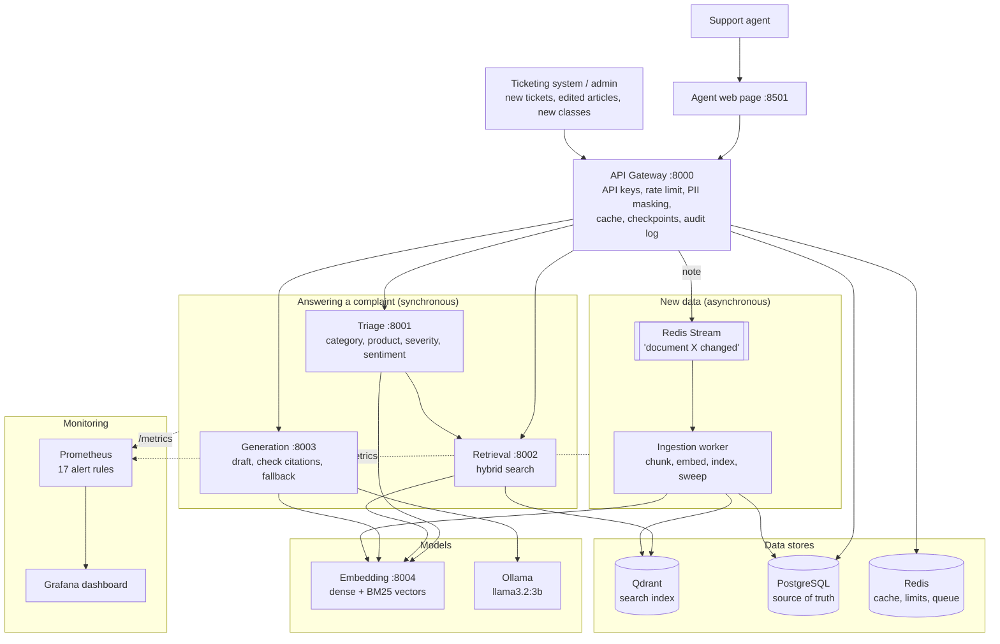
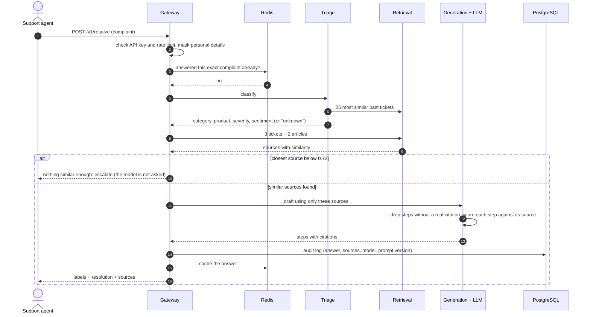
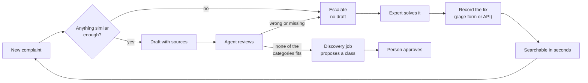

# Intelligent Support Ticket Resolution Assistant: Architecture

**Use Case 2 · Telecom support desk · Semantic search + RAG · Microservices**

> **In one sentence:** a support agent pastes a raw customer complaint and gets back (1) what the
> complaint is about, (2) the most similar past tickets and help articles, and (3) a step-by-step
> fix drafted by a language model that cites exactly which tickets and articles it used.

This document describes the system **as it was built and measured**. Every number in it comes
from an eval in `evals/`, run on a laptop with no GPU. The reasons behind each choice, with the
measurements that drove them, are in [DESIGN_DECISIONS.md](DESIGN_DECISIONS.md).

---

## 1. The problem, in plain words

| | Today (keyword search) | What was built (semantic search + RAG) |
|---|---|---|
| How agents search | Type "router" or "billing" | Paste the whole complaint as it is |
| What goes wrong | "My wifi keeps dying at night" does not match a ticket titled "Evening broadband drops caused by peak-hour congestion", because the words differ | Matches by **meaning**, not words |
| What the agent gets | A list of tickets to read one by one | Labels, the closest past cases, and a drafted fix with sources, ready to review |

**The three things the brief asks for:**

1. **Parse** the complaint: category, product, severity, customer sentiment.
2. **Retrieve and generate**: find similar resolved tickets and knowledge-base (KB) articles, then
   draft a grounded, cited, step-by-step resolution.
3. **Handle evolving data and ticket classes**: new tickets, edited articles and brand-new kinds
   of problem must work without rebuilding the system.

**What the example complaint in the brief tells us:**

- *"drops every evening around 8"*: a time pattern, which points to congestion, not a broken router.
- *"already restarted the router twice"*: the answer must **not** repeat what the customer already tried.
- *"I work from home and this is costing me"*: business impact raises the severity.
- The user is a **support agent**, not the customer. The system writes a **draft**. A person
  reviews it before anything reaches the customer. The evals in section 8 show why that matters.

---

## 2. Words you need to know

| Term | Simple meaning |
|---|---|
| **Embedding** | Turning a sentence into a list of numbers (here 384) so that sentences with similar meaning get similar numbers. |
| **Vector database** | A database that stores those lists and quickly finds the closest ones. Here: Qdrant. |
| **Semantic (dense) search** | Search by meaning: embed the complaint, find the nearest stored embeddings. |
| **BM25 (sparse, keyword) search** | Classic word matching. Still useful for exact things such as the error code `E-102`. |
| **Hybrid search** | Both searches together, merged into one ranking. |
| **LLM** | Large language model, the text-writing AI. Here a small free one (`llama3.2:3b`) run locally with Ollama. |
| **RAG** | Retrieval-Augmented Generation: first *retrieve* real documents, then ask the LLM to write an answer *using only those documents*. |
| **Grounded, citation** | Every step in the answer points to the ticket or article it came from. |
| **kNN (nearest neighbours)** | Label a new item by looking at the labels of the most similar known items. |
| **Microservice** | A small program with one job that talks to other small programs over HTTP. |
| **Eval** | A script that runs test cases with known answers through the system and reports a score. |

---

## 3. Architecture diagram

### 3.1 System overview



### 3.2 The same picture as plain text

```
                     Support agent                    Admin / ticketing system
                          |                                     |
                   [ Web page :8501 ]                           |
                          |                                     |
                   [ API GATEWAY :8000 ] <----------------------+
        API keys, rate limit, PII masking, cache, checkpoints, audit log, feedback
          |              |               |                |
     [ TRIAGE ]    [ RETRIEVAL ]   [ GENERATION ]    Redis Stream (queue)
      labels by     hybrid search   draft + checks         |
      neighbour          |               |          [ INGESTION WORKER ]
      vote  ------------>|          [ OLLAMA ]       reads PostgreSQL,
          \              |           local LLM       embeds, updates index
           \             |               |                 |
            +---->[ EMBEDDING SERVICE ]<-+-----------------+
                         |
                    [ QDRANT ] search index        [ POSTGRESQL ] source of truth

   Every service publishes /metrics --> Prometheus (alerts) --> Grafana (dashboard)
```

### 3.3 What happens on one request



The web page makes this call twice: first with `generate: false` (labels and sources, under a
second), then the full call (about 30 seconds with a local model on a CPU). The agent can start
reading past tickets while the draft is being written.

---

## 4. The services

Seven small programs of our own, plus ready-made infrastructure.

| Service | Port | Its one job | Talks to |
|---|---|---|---|
| **Gateway** | 8000 | The only front door. API keys (agent and admin), rate limit, PII masking, cache, runs the steps in order, checkpoints, audit log, feedback, data and class endpoints. | Triage, Retrieval, Generation, Redis, PostgreSQL |
| **Triage** | 8001 | Category, product, severity and sentiment, each with a reason or a confidence. Says "unknown" when unsure. | Retrieval, Embedding |
| **Retrieval** | 8002 | Finds the most similar tickets and KB sections (hybrid search). | Embedding, Qdrant |
| **Generation** | 8003 | Builds the prompt, calls the LLM, checks the answer. If the model fails it asks the backup model (when one is set), and if that fails too it quotes the source. Also writes the reply to the customer from the checked steps. | Ollama (or a hosted model), Embedding |
| **Embedding** | 8004 | The only place the small models live: text to dense vector, text to BM25 vector. | none |
| **Ingestion worker** | 8005 (metrics) | Keeps the search index in step with PostgreSQL. Retries, dead-letter list, safety sweep. | Redis, PostgreSQL, Embedding, Qdrant |
| **Web page** | 8501 | Paste a complaint, see labels, the drafted fix and its sources, draft the reply to the customer, and give feedback. | Gateway |

| Infrastructure | Why it is there |
|---|---|
| **PostgreSQL** | Source of truth: tickets, articles, ticket classes, audit log, feedback, class proposals. |
| **Qdrant** | Search index. Can always be rebuilt from PostgreSQL. |
| **Redis** | Answer cache, rate-limit counters, the ingestion queue. |
| **Ollama** | Runs the LLM locally. No API key, no cost. |
| **Prometheus, Grafana** | Collect the numbers, check the alert rules, show the dashboard. |

### The main API call

`POST /v1/resolve` with header `X-API-Key`

```json
{ "complaint": "My broadband drops every evening around 8 and I've already restarted the router twice, I work from home and this is costing me" }
```

Response (shortened; the field names are real, the values are an example):

```json
{
  "request_id": "9f1c...",
  "triage": {
    "category":  {"label": "connectivity_intermittent", "confidence": 0.86, "best_guess": "connectivity_intermittent"},
    "product":   {"label": "broadband", "confidence": 0.93},
    "severity":  {"label": "high", "reasons": ["business_impact"]},
    "sentiment": {"label": "negative"},
    "needs_review": false
  },
  "sources": [
    {"id": "KB-001", "source_type": "kb", "title": "Evening broadband drops caused by peak-hour congestion", "similarity": 0.91}
  ],
  "resolution": {
    "mode": "llm",
    "summary": "Peak-hour congestion on the local network is the most likely cause.",
    "already_tried": ["restarted the router twice"],
    "steps": [
      {"n": 1, "text": "Run a remote line test at peak time.", "citations": ["KB-001", "T-000481"],
       "support": 0.93, "verified": true, "repeats_already_tried": false}
    ],
    "grounded": true
  },
  "escalate": false,
  "meta": {"cached": false, "degraded": [], "confident_match": true, "top_similarity": 0.91,
           "model": "llama3.2:3b", "prompt_version": "v2", "index_version": "12",
           "latency_ms": {"triage": 180, "retrieval": 90, "generation": 31000, "total": 31300}}
}
```

Other endpoints on the gateway:

| Endpoint | Who | What |
|---|---|---|
| `POST /v1/reply` | agent | The message for the customer of an earlier answer, by its `request_id`. Built only from steps that passed the source check |
| `POST /v1/feedback` | agent | Helpful or not, a comment, and the right category if ours was wrong |
| `GET /v1/taxonomy` | agent | The ticket classes in use |
| `POST /v1/tickets`, `PUT /v1/kb/{id}`, `DELETE /v1/documents/{id}` | admin | Add, update or retire a ticket or article |
| `POST /v1/taxonomy`, `DELETE /v1/taxonomy/{kind}/{name}` | admin | Add or retire a class |
| `GET /v1/classes/proposals`, `POST .../approve`, `POST .../reject` | admin | Review new classes suggested by the discovery job |
| `GET /v1/documents/{id}`, `GET /v1/ingest/status` | admin | Has the search index caught up? |
| `/health`, `/ready`, `/metrics` | none | On every service |

---

## 5. How each requirement is solved

### 5.1 Requirement 1: parse the complaint (triage)

| Field | How | Why this way |
|---|---|---|
| **Category, product** | The 25 most similar past tickets vote. Closer tickets get a much bigger vote. | No training step. A new class works as soon as labelled tickets exist. Milliseconds per request. |
| **Severity** | A baseline from similar past tickets, moved up or down by urgency signals (business impact, outage, vulnerable customer). The reasons are returned. | Severity is business policy, so the rules must be visible and editable. |
| **Sentiment** | Tone signals. No signal found means neutral. | |
| **Signals** | Each signal is a short list of example sentences in `services/triage/signals.yaml`. A sentence of the complaint matches a signal when its **meaning** is close to an example. | Catches wordings a keyword list would miss, and support staff can edit the examples without touching code. |
| **"unknown"** | If nothing similar exists, or the vote is too split, the label is `unknown` and the complaint is flagged for review. | An honest "I don't know" is better than a confident wrong label. |
| **Thresholds** | Fitted by `evals/eval_triage.py --calibrate` on one half of the eval data and reported on the other half. | No hand-picked numbers, and no grading on the data used for tuning. |

### 5.2 Requirement 2: retrieve and generate (RAG)

**Retrieval**

| Step | What happens |
|---|---|
| 1. Embed the complaint | One dense vector (`BAAI/bge-small-en-v1.5`, 384 numbers) and one BM25 vector. |
| 2. Search per source type | Tickets and KB articles are searched separately, so tickets cannot crowd out articles. |
| 3. Merge | Dense and BM25 results are merged by rank (Reciprocal Rank Fusion), with the dense side counting three times as much. |
| 4. Return | 3 tickets and 2 articles, each with its **cosine similarity** to the complaint. |

What gets embedded:

- **Tickets:** the customer's *problem* text. The resolution steps travel along as stored data.
  A new complaint should match old complaints, not old answers.
- **KB articles:** split at each heading. Small sections match more precisely, and each section
  carries the whole article for the LLM to read.

A reranker was built and measured, and is switched off: it added about 900 ms per search and did
not improve accuracy on this data (see DESIGN_DECISIONS.md).

**Generation**

1. Sources that say the same thing are grouped. The model sees the best three, shortened.
2. The prompt puts the complaint and the sources in clearly marked blocks and says they are data,
   not instructions.
3. The model must reply in a **JSON format** in which a citation can only be one of the source
   IDs it was shown. An invented source ID is impossible, not just unlikely.
4. **Checks after the model answers:**
   - a step without a real citation is dropped;
   - each step is compared by meaning with the source it cites, and marked "not verified" if they are far apart;
   - a step that repeats something the customer already tried is flagged.
5. **Fallback:** if the model is down, too slow, or returns something unusable twice, the
   resolution steps of the best matching source are quoted directly, and labelled as quoted.
   The system returns something useful with no model at all.

### 5.3 Requirement 3: evolving data and ticket classes

**New data**

```
admin --> gateway --> PostgreSQL (saved first)
                  \-> Redis Stream: "ticket T-123 changed"
                                |
                        ingestion worker: read the CURRENT document from PostgreSQL,
                        embed it, write it to Qdrant, mark it as indexed
```

| Situation | What happens |
|---|---|
| A ticket is resolved | `POST /v1/tickets`. Searchable a few seconds later. No retraining, no restart. |
| An article is edited | `PUT /v1/kb/{id}`. New sections are written first, leftover old sections removed after, so the article never disappears from search. |
| A fix is outdated | `DELETE /v1/documents/{id}`. Removed from search, kept in PostgreSQL so old answers can still be traced. |
| The same note arrives twice | Harmless. The note only says which document changed, and index IDs are derived from the document ID. |
| Indexing fails | Retried. After 5 failures the note moves to a dead-letter list, with an alert. |
| The note is lost | Every minute a sweep compares `indexed_at` with `updated_at` in PostgreSQL and repairs anything behind. |
| Cached answers | The worker raises an index version that is part of every cache key, so an answer cached before a change is not served after it. |
| A new embedding model | Services search an alias. A new collection is built in the background and the alias is switched. |

**When a complaint is new: the whole loop**



| Step | What should happen | Where it is |
|---|---|---|
| 1. Notice | Realise that nothing known really fits | Similarity cut-off in the gateway. Measured weak spot: a new telecom problem that looks like an old one gets through. A second check (cross-encoder relevance) is built, off by default, and measured by `evals/eval_relevance_gate.py`. |
| 2. Do not guess | Hand it to an expert | The gateway escalates, drafts nothing, still shows the closest sources |
| 3. Human safety net | A person reviews every draft | Sources and similarity on the page, "not helpful", "none of the categories fits" |
| 4. Learn | The expert's fix goes into the system | The Record a fix page, or `POST /v1/tickets`. Searchable in seconds. |
| 5. Spot a trend | Similar unknown complaints mean a new kind of problem | Discovery job and class proposals |
| 6. Raise an alarm | Tell someone the world has changed | Drift alerts in Prometheus |

**New classes**

1. Classes are **rows in a `taxonomy` table**. Adding one is an API call.
2. Triage needs no retraining: it votes over labelled tickets, so a class appears as soon as tickets carry it.
3. A ticket with a class that does not exist is refused, so a typo cannot create a class.
4. **Spotting a class nobody has named yet.** One complaint about a new kind of problem looks just
   as familiar as any other (measured: only 5% are flagged). A group of them stands out. So the
   agent can mark "none of the categories fits", and a discovery job groups similar flagged
   complaints and proposes a class with examples and keywords.
5. A person approves or rejects each proposal and gives the class its name.

---

## 6. Data

Synthetic telecom support data, generated by `scripts/generate_data.py` (fixed seed, so anyone
gets the same files). The public datasets suggested in the brief are not telecom or have no
labels, and synthetic data gives an answer key for the evals.

| File | Rows | What it is |
|---|---|---|
| `tickets.jsonl` | 1,440 | Resolved tickets: 36 hand-written problem scenarios, 40 wordings each. Indexed. |
| `kb_articles.jsonl` | 41 | One article per scenario plus 5 general ones. Indexed. |
| `test_queries.jsonl` | 360 | Complaints in **wording that never appears in the index**. Used only by evals. |
| `out_of_scope.jsonl` | 30 | Questions that are not about telecom. The system should refuse them. |
| `holdout_*.jsonl` | 160 / 40 / 4 | Two whole classes (eSIM, fraud) kept out of the index, to test new classes. |

Every row keeps its `scenario_id`. That is the answer key: a source is "right" for a complaint
when both come from the same scenario. A test checks that test wordings never leak into the index.

| Store | Holds |
|---|---|
| PostgreSQL `tickets`, `kb_articles` | The documents, with `is_active`, `updated_at`, `indexed_at` |
| PostgreSQL `taxonomy`, `class_proposals` | Ticket classes and suggested new ones |
| PostgreSQL `resolve_requests`, `feedback` | Audit log (masked complaint, labels, sources, answer, model, prompt and index version, timings) and agent feedback |
| Qdrant `support_knowledge` (alias) | One point per ticket or KB section: dense vector, BM25 vector, labels, text |

---

## 7. Technology choices

The full list, with alternatives and the measurements behind them, is in
[DESIGN_DECISIONS.md](DESIGN_DECISIONS.md). The ones that shape the system:

| Decision | Chosen | Why |
|---|---|---|
| Search | Hybrid, dense weighted 3x, no reranker | Measured. Matches the best accuracy and still finds exact codes. The reranker cost 900 ms for no gain. |
| Triage | Nearest-neighbour vote plus example-based signals | No retraining when classes change. Every label comes with a reason. |
| LLM | `llama3.2:3b` through an OpenAI-compatible API | Free, runs for a reviewer with no key. A hosted model is a change of three settings, and it can be put first with Ollama as its backup (GUIDE.md, 'Choosing the language model'). |
| Model output | JSON constrained to a schema | Always parseable, and source IDs cannot be invented. |
| No model available | Quote the best source | The system never returns nothing. |
| Read path and write path | Separate: synchronous answers, queued indexing | Heavy indexing must never slow an agent down. |
| Source of truth | PostgreSQL. Qdrant is a rebuildable index. | If the index is lost or the model changes, rebuild it. |
| Queue safety | Stream for speed, database sweep for certainty | Writing to two systems cannot be made atomic. |
| Embedding service | One service owns the models | One copy in memory, one version everywhere. |
| Models in images | Downloaded and verified at build time | Fast, repeatable starts with no internet. A broken model fails the build. |

---

## 8. Checkpoints, evals and monitoring

### 8.1 Checkpoints inside the pipeline

| # | Checkpoint | If it fails |
|---|---|---|
| 1 | API key and rate limit | 401, 403 or 429 |
| 2 | Input validation | 422 with a clear message |
| 3 | PII masking, before any other service, the cache or the database sees the text | Never skipped |
| 4 | Triage confidence | Label `unknown`, flag for review |
| 5 | Closest source at least 0.72 similar | The model is not asked. Escalation is recommended. |
| 6 | Model output follows the JSON format | One retry, then quote the source |
| 7 | Every step has a real citation | The step is dropped |
| 8 | Each step is close in meaning to its cited source | Marked "not verified", `grounded: false` |
| 9 | Step repeats what the customer tried | Flagged |
| 10 | The customer reply uses only steps that passed 8 and 9 | Other steps are left out and the agent is told how many. No usable step: the reply offers no fix |
| 11 | A person reviews the draft and the reply | Feedback and category corrections are stored |

### 8.2 Evals and what they measured

Embedding model `BAAI/bge-small-en-v1.5`, LLM `llama3.2:3b`, laptop CPU. Result files are in
`evals/results/`.

**Search** (`eval_retrieval.py`, 360 complaints in unseen wording)

| Setup | Right ticket first | Right ticket in top 3 | Right source among the 5 given to the LLM | Median time |
|---|---|---|---|---|
| Keyword only (today's baseline) | 0.397 | 0.525 | 0.608 | 50 ms |
| Dense only | 0.542 | 0.714 | 0.822 | 50 ms |
| Hybrid, equal weights | 0.489 | 0.697 | 0.789 | 53 ms |
| **Hybrid, dense 3x (in use)** | **0.550** | **0.714** | **0.831** | 54 ms |

Semantic search beats keyword search: the right ticket comes first for 55% against 40%.

**Triage** (`eval_triage.py`, 215 complaints the tuning never saw)

| Label | Accuracy |
|---|---|
| Category | 0.711 (0.756 if "unknown" is not counted as wrong) |
| Product | 0.783 |
| Severity | 0.594 exact, 0.933 within one level |
| Sentiment | 0.828 |
| Off-topic questions flagged "unknown" | 0.867 |
| New-class complaints flagged "unknown" | 0.050 |

**New data and new classes** (`eval_evolving.py`)

| Resolved tickets added per new problem type | Right past ticket in top 3 | Category correct | Seconds until searchable |
|---|---|---|---|
| 0 | 0.000 | 0.000 | |
| 3 | 0.450 | 0.000 | 3.2 |
| 10 | 0.625 | 0.275 | 3.7 |
| 40 | 0.625 | 0.475 | 4.7 |

Search learns a new problem from a handful of tickets. Triage is slower and uneven: fraud was
learned well (18 of 20), eSIM hardly at all (1 of 20), because eSIM complaints sit close to two
existing classes that have many more tickets. The discovery job separated the two new classes
into two clean groups at a similarity of 0.85, and only there (they merge at 0.80, nothing groups at 0.90).

**Final answers** (`eval_answers.py`, through the gateway)

| Group | Complaints | Cites the right problem | Cites a wrong problem | Escalated, no answer |
|---|---|---|---|---|
| Known problems | 20 | 14 | 6 | 0 |
| New class (no fix exists) | 6 | 0 | 6 | 0 |
| Off topic | 30 | 0 | 7 | 23 |

- 70% of answers to known problems cite the right problem. 5 of the 6 wrong ones were search
  misses, 1 was the model. When search finds the right source, the model uses it 14 times out of 15.
- Every step was backed by its cited source. That check catches invented steps. It cannot catch a
  real step copied from a source about the wrong problem.
- "Already tried" was noticed in 11 of 11 complaints and repeated as a step once.
- The 0.72 cut-off stops 77% of off-topic questions and 1.4% of real complaints.
- **The model does not know when it does not know.** It drafted a fix for every new-class
  complaint and every off-topic question that passed the cut-off. An attempt to make it decide
  explicitly (prompt v3) made it refuse everything, including the answers it gets right, so it
  was rejected and is kept behind a setting for a larger model.
- A typical answer takes 31 seconds.

### 8.3 Monitoring

| Question | What is watched | Example alert |
|---|---|---|
| Is it up and fast? | `up`, error share, time per stage | A service is down for a minute. More than 5% of requests fail. |
| Are the answers good? | Share drafted by the model, steps failing the source check, agent feedback, category corrections | More than 40% "not helpful". The model is not being used. |
| Has the world changed? | Similarity of the closest match, share escalated, share triage cannot label | Half of recent complaints are below 0.75 similarity. |
| Is new data arriving? | Queue length, time since the last indexed document, dead letters | Work is waiting and nothing was indexed for 10 minutes. |

- **17 alert rules**, each with what is wrong and what to do first. They have unit tests
  (`promtool test rules`), run in CI.
- **One Grafana dashboard**, built from a short Python list. A test checks every query against
  the metric names in the code, so a renamed metric cannot leave a silently empty panel.
- **`scripts/health_check.py`**: one command that checks every service, sends a real complaint
  and an off-topic question through the gateway, and lists firing alerts.
- **Logs**: one JSON line per request. The same request ID appears in every service it touched.
- **CI** (GitHub Actions): code style, 292 fast tests, compose file, Prometheus config and alert tests.
  22 more tests run against the live system.

---

## 9. Production scale considerations

| Area | Now (one laptop) | At scale |
|---|---|---|
| **Scaling** | One container per service | Services hold no state, so run several copies behind a load balancer (Kubernetes, autoscaling) |
| **LLM** | 3B model on CPU, about 31 s per answer | GPU serving or a hosted model: seconds. Stream the answer so text appears at once. |
| **Model quality** | Cannot judge whether a source fits | A larger model for that one decision. The setting and the eval for it already exist. |
| **Search quality** | Right source among the five for 83% | A stronger embedding model (one setting, then re-index and re-run the eval) |
| **Vector database** | One Qdrant node, 1,589 points | 1 million tickets x 384 numbers x 4 bytes is about 1.5 GB: still one node. Beyond that: sharding, replication, quantization. |
| **Ingestion** | Redis Streams, one worker | More workers in the same group (`--scale ingestion=3`). Kafka at very high volume. |
| **Cache** | Exact match, one hour, dropped when the index changes | Per-document invalidation. A semantic cache only with its own eval. |
| **Reliability** | Timeouts, retries, fallback, fail-open cache and limiter, database sweep | Circuit breakers, several zones, backups of PostgreSQL and Qdrant snapshots |
| **Security** | Agent and admin API keys, PII masking, non-root containers, ports bound to localhost | Single sign-on with roles, a secret manager, encryption at rest |
| **Prompt injection** | Complaint and sources fenced off as data. Citations limited to real source IDs. | An input classifier and an output filter |
| **Monitoring** | Prometheus and Grafana on the same machine | Alertmanager to a pager, long-term storage, request tracing |
| **Versioning** | Model, prompt and index version stored with every answer | A/B tests between prompt or model versions, judged by the same evals |
| **Cost** | Zero | The LLM is the main cost: cache, stop before the model when nothing matches, small model for most traffic |
| **Languages** | English | A multilingual embedding model |

---

## 10. Repository structure

```
├── README.md                 what it is, how to run it, what was measured
├── docker-compose.yml        12 containers, started with one command
├── .env.example              every setting, no secrets
├── docs/
│   ├── ARCHITECTURE.md       this file
│   ├── DESIGN_DECISIONS.md   each choice, the alternative, and the measurement behind it
│   └── GUIDE.md              every address and command
├── libs/common/              shared code: logging, metrics, PII masking, service clients
├── services/
│   ├── gateway/              front door, orchestration, data and class endpoints
│   ├── triage/               labels (logic.py holds the rules, signals.yaml the examples)
│   ├── retrieval/            hybrid search
│   ├── generation/           prompt, answer checks, fallback
│   ├── embedding/            the small models
│   └── ingestion/            indexer, worker, new-class discovery
├── ui/                       the web pages (Streamlit): app.py (menu), page_*.py (one per page),
│                             components.py (the HTML parts), api.py (gateway calls), style.css
├── data/
│   ├── scenarios/            40 hand-written problem scenarios (the source of all data)
│   └── generated/            tickets, articles, test complaints
├── scripts/                  generate_data, seed, migrate, demo, health_check, add_document, discover_classes
├── evals/                    eval_retrieval, eval_triage, eval_evolving, eval_answers, eval_relevance_gate, results/
├── infra/                    PostgreSQL schema, Prometheus rules, Grafana dashboard, CI workflow
└── tests/                    292 fast tests, 22 tests against the live system
```

How a reviewer runs it (no API key needed):

```bash
cp .env.example .env
docker compose up -d --build
docker compose run --rm tools python scripts/seed.py
# open http://localhost:8501
```

With Ollama installed and `ollama pull llama3.2:3b` done, answers are drafted by the model.
Without it, answers are quoted from the best matching source, so it still works.

---

## 11. How it was built

Each part was built, measured, and changed where the measurement disagreed with the plan.

| Plan | What the measurement said | What changed |
|---|---|---|
| Hybrid search plus a reranker | Equal-weight hybrid was worse than dense alone. The reranker added 900 ms for no gain. | Dense weighted 3x, reranker off |
| Remove "noise" sentences from the complaint before searching | No gain for tickets | Not built |
| A similarity threshold to spot new classes | Only 5% of new-class complaints were flagged | Agent corrections plus a grouping job |
| Discovery threshold 0.80 | The two new classes merged into one group | 0.85 |
| A prompt rule "escalate if the sources do not fit" | Ignored 13 times out of 13 | Tried making it part of the answer format |
| The model decides explicitly whether the source fits | It refused everything | Rejected, kept behind a setting |

---

## 12. How this maps to the evaluation

| Dimension | Weight | Where |
|---|---|---|
| Problem understanding | 15 | Section 1. "Already tried" handling, the agent as reviewer, escalation instead of guessing. |
| Solution depth, production scale | 25 | Sections 3 to 5 and 9. Read and write paths, fallbacks, queue with sweep, cache versioning, capacity. |
| Design decisions | 20 | Section 7, section 11, and DESIGN_DECISIONS.md with the measurements. |
| Code | 25 | Section 10. 314 tests (292 fast, 22 against the running system), CI, typed request models, one-command run. |
| Checkpoints, evals, monitoring | 15 | Section 8. Eleven checkpoints, five evals, 17 tested alerts, a dashboard, a health check. |

| Deliverable | Where |
|---|---|
| Architecture diagram | Section 3 |
| Executable code on GitHub | The repository. README has the commands, docs/GUIDE.md has every one of them. |
| Additional exploration | Section 11, new-class discovery, the match-check experiment, cache versioning |
| Evals on system health | Section 8 |
| Production scale considerations | Section 9 |

---

## 13. Known limitations

- **It does not know when it does not know.** For a telecom problem the knowledge base does not
  cover, the local model drafts a confident answer from the closest wrong source. The larger hosted
  model refused 3 of 6 such complaints and answered the other 3 wrongly. A person must review every draft.
- **Search is the bottleneck.** The right source is among the five given to the model for 83% of
  complaints. Most wrong answers start there.
- **"Grounded" is not "correct".** The source check proves a step was copied faithfully, not
  that it answers the right question.
- **New classes that overlap old ones are learned badly** by a nearest-neighbour vote.
- **Synthetic data** is cleaner than real tickets, and the test wording is deliberately hard.
  Real results would differ in both directions.
- **Small samples.** The answer eval covers 20 known complaints, because each answer takes half a
  minute on a CPU. The numbers show direction, not precision.
- **Thresholds were tuned on this dataset** (0.72 cut-off, 0.85 grouping, triage settings).
  They would need re-tuning on real traffic, and after any change of embedding model.
- English only. A small local model is slow and weak compared with hosted ones.
